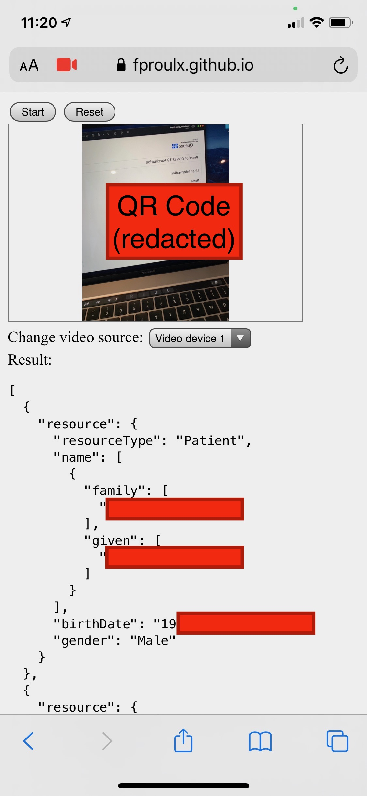
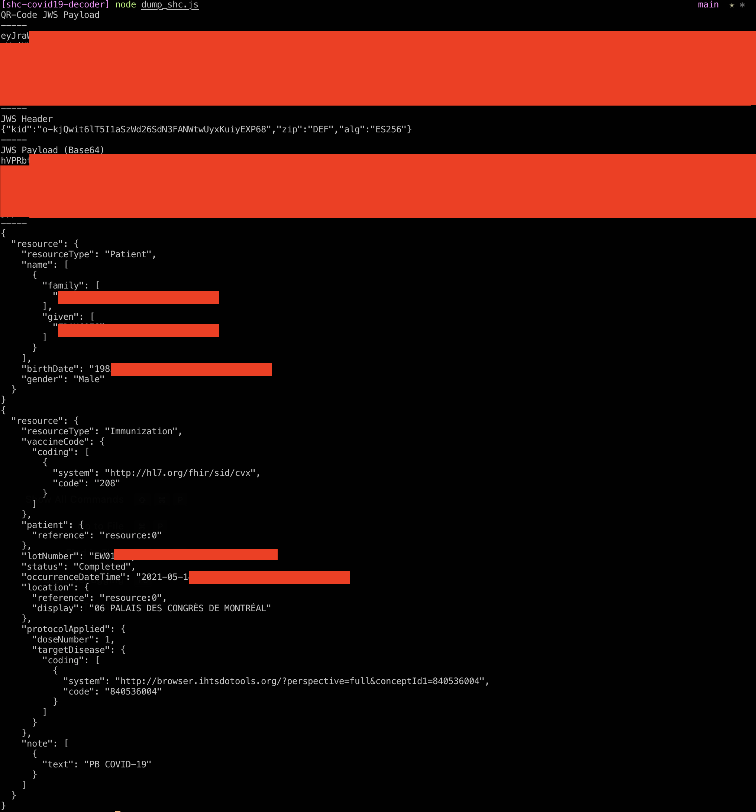

# shc-covid19-decoder

Visit simple hosted version on your phone (does NOT transmit any data, all remains in your browser)
https://fproulx.github.io/shc-covid19-decoder/

About
Very simple app to decode your Vaccination Proof QR Code (such as the one provided by government of Quebec) - Compatible with SHC (Smart Health Card standard).

# Building

- `npm run build` compiles the JS
- `npm run dev` compiles the JS in watch mode
